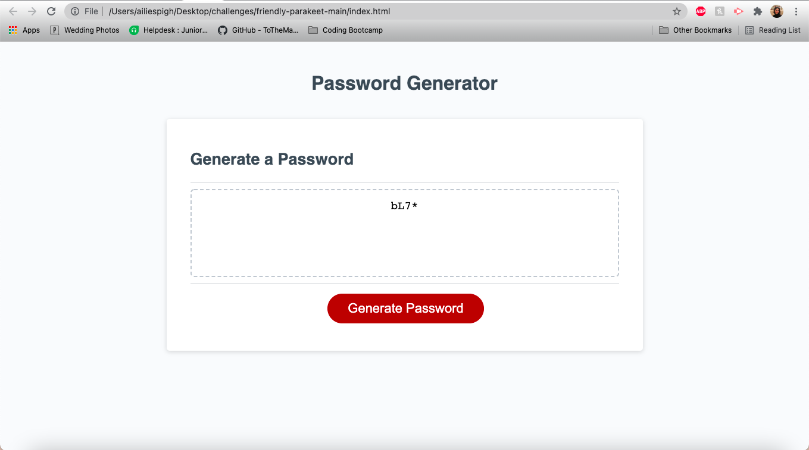

# Password Generator Starter Code
This is a random password generator that should:

Prompt the user to input a password length

Ask user if they'd like lowercase, uppercase, numerical, and/or symbols in their password

Generate the password or provide an error message. 

Aili's notes: 
- Develop branch was main trial and error branch, realized I had to move the variables inside my function, so created the testbranch to try my theory without messing up the develop branch. Left develop branch as is for future investigations/learnings. 

- Was able to merge testbranch to main and main to origin git. 

- Input is working correctly, prompts are working correctly, but unable to make the password length actually force the length the user input. I believe it's something in the "for" function with i, and maybe setting i to the password length, but that didn't run the loop... tried adding mimimum length of the password length to the math.floor functions and it created undefined errors for my variables. 

Here is where you enter

Here is what is generated 

